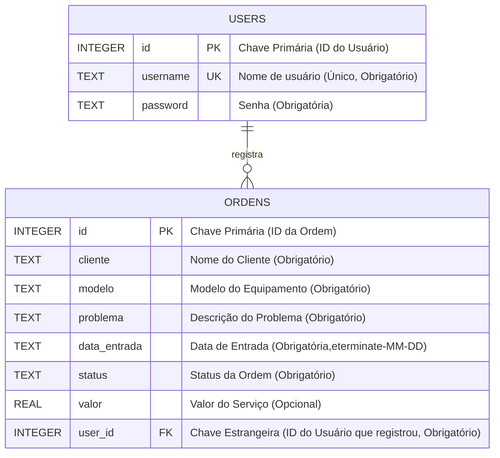

# Sistema de Gerenciamento de Ordens de Serviço para Oficinas

   

## Contexto do Projeto

Este projeto foi desenvolvido como parte da disciplina de **Projeto Integrador De Tecnologia Da Informação II** do **Curso Superior de Tecnologia da Informação** da **UFMS Digital**, durante o semestre letivo **2025.1**. Ele visa aplicar conhecimentos de desenvolvimento web para solucionar um problema real, cumprindo também requisitos de atividades de extensão universitária.

## Problema

O projeto surgiu da necessidade observada em uma pequena oficina de conserto de computadores que utilizava planilhas do Excel para gerenciar suas ordens de serviço. Este método manual apresentava desafios como:

* Dificuldade em manter as informações organizadas e atualizadas.
* Ineficiência no rastreamento do status de cada serviço.
* Risco de perda de dados ou inconsistências.
* Tempo excessivo gasto em tarefas administrativas manuais.

## Solução Proposta

Foi desenvolvida uma **aplicação web utilizando Flask (Python)** para oferecer uma alternativa organizada e eficiente às planilhas. O sistema permite o cadastro, consulta, atualização e exclusão de ordens de serviço, além de controle de acesso por usuário.

## ✨ Funcionalidades Principais

* **Autenticação de Usuários:**
    * Tela de Registro de novos usuários.
    * Tela de Login seguro.
    * Funcionalidade de Logout.
    * Acesso às funcionalidades de ordens de serviço restrito a usuários logados.
* **Gerenciamento Completo de Ordens de Serviço (CRUD):**
    * **C**adastrar novas ordens (cliente, modelo, problema, data, status inicial, valor opcional).
    * **L**istar todas as ordens cadastradas em uma tabela na página principal.
    * **A**tualizar informações de ordens existentes através de um formulário de edição.
    * **R**emover ordens do sistema (com confirmação).
* **Busca e Filtragem:**
    * Campo de busca para encontrar ordens pelo nome do cliente.
    * Filtro para exibir ordens por status específico (Em Análise, Aguardando Peças, Em Reparo, Concluído).
* **Interface Amigável:** Utilização de Bootstrap 5 para um layout responsivo e limpo, com feedback visual para o usuário (mensagens flash).
* **Persistência de Dados:** Uso de bancos de dados SQLite (`database.db` para ordens, `users.db` para usuários) para armazenamento seguro das informações.

## 🛠️ Tecnologias Utilizadas

* **Back-end:** Python 3, Flask 3.1.0
* **Banco de Dados:** SQLite 3
* **Front-end:**
    * HTML5 (Templates Jinja2)
    * CSS3 (Bootstrap 5 via CDN + `static/css/styles.css`)
    * JavaScript (Básico, para validação em `static/js/script.js`)
* **Ambiente:** Python Virtual Environment (`venv`)
* Controle de Versão: Git, GitHub

## 💾 Estrutura do Banco de Dados

O sistema utiliza SQLite para persistência de dados... (Diagrama Entidade-Relacionamento):


## 🚀 Como Executar o Projeto Localmente

1.  **Clone o repositório:**
    ```bash
    git clone https://github.com/LCRamos21/projeto-integrador-oficina.git
    ```
2.  **Navegue até a pasta do projeto:**
    ```bash
    cd projeto-integrador-oficina
    ```
3.  **(Recomendado) Crie e ative um ambiente virtual:**
    * No Linux/macOS:
        ```bash
        python3 -m venv venv
        source venv/bin/activate
        ```
    * No Windows:
        ```bash
        python -m venv venv
        .\venv\Scripts\activate
        ```
4.  **Instale as dependências:**
    * Use o arquivo `requirements.txt` fornecido:
        ```bash
        pip install -r requirements.txt
        ```
5.  **Execute a aplicação Flask:**
    * Rode o arquivo principal `app.py`:
        ```bash
        python app.py
        ```
Observação: Ao ser executado pela primeira vez, o `app.py` criará automaticamente os arquivos de banco de dados SQLite (`users.db` e `database.db`) e as tabelas necessárias (`users`, `ordens`), caso ainda não existam, usando comandos `CREATE TABLE IF NOT EXISTS`. O arquivo `schema.sql` no repositório serve como documentação formal da estrutura.
        
6.  **Acesse no navegador:** Abra seu navegador e vá para `http://127.0.0.1:5000` (ou o endereço indicado no terminal).
    * Você precisará se registrar para acessar a área de gerenciamento de ordens.

## 📈 Status do Projeto

* Funcionalidades de autenticação, CRUD de ordens, busca e filtro implementadas e funcionais.
* Modelo de dados formalizado e schema SQL (`schema.sql`) criado.
* Atende aos requisitos definidos para os Módulos 1, 2 e 3 do Projeto Integrador II.

## 🔮 Possíveis Melhorias Futuras

* Implementação de relatórios gerenciais.
* Sistema de notificações para status de ordens.
* Controle básico de estoque de peças associado às ordens.
* Melhorias na validação de dados de entrada.
* Testes automatizados.
* Implantação em um servidor web (ex: Heroku, PythonAnywhere).

## 👨‍💻 Autor

* **LCRamos21** - [https://github.com/LCRamos21](https://github.com/LCRamos21)
